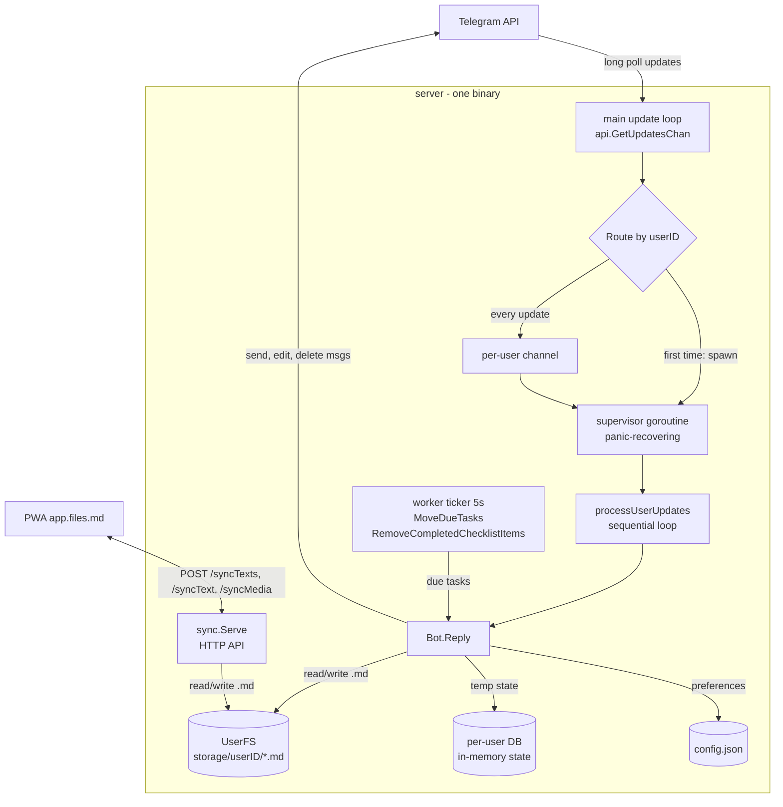
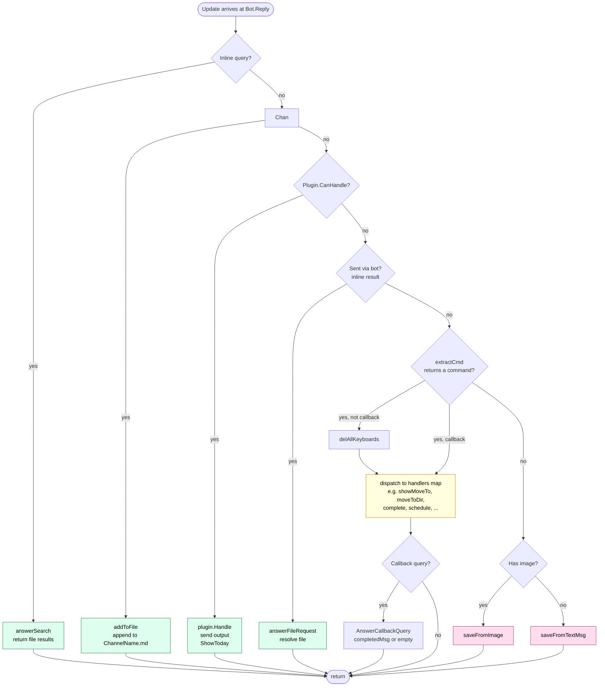
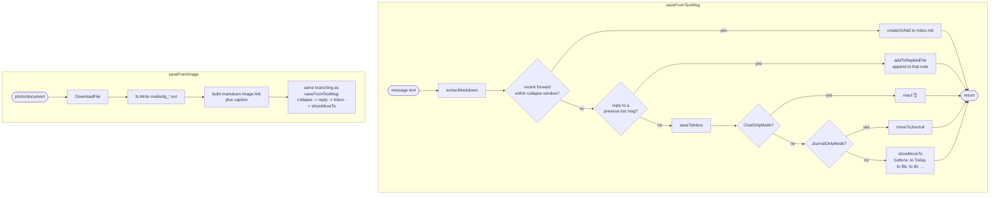

# Telegram bot

How the server wires Telegram updates into per-user workers and how `Bot.Reply` decides what to do with each message.

## High-level architecture

The server runs one binary with three long-running components:

- **Telegram update loop** (`cmd/server/server.go`) - long-polls Telegram, routes each update to a per-user goroutine. Per-user channels serialize one user's messages so concurrent edits to the same files can't race.
- **HTTP sync server** (`server/sync`) - serves the PWA's sync requests (`/syncTexts`, `/syncText`, `/syncMedia`). When the web app changes `Today.md` or the inbox, it calls `OnTodayUpdate` which triggers the bot to send the user a fresh "Today" keyboard so the two stay in lockstep.
- **Worker ticker** - every 5 seconds moves scheduled tasks out of `later` into `today`, and prunes completed checklist items.

Everything reads and writes the same per-user filesystem tree (`UserFS`), which is the single source of truth - `.md` files on disk. The PWA fetches those same files through the sync API.

## `Bot.Reply` - reply flow

The decision is strictly top-to-bottom - the first matching case wins. Green terminals are read-only or side-channel responses; yellow is the large callback/command dispatch table; red is the save path for fresh user content.

### Main steps inside the save paths

Both save paths converge on `saveToInbox` (append to `Inbox.md` with a timestamp) and then `showMoveTo`, which presents the user with action buttons. Picking a button fires a callback that re-enters `Bot.Reply`, hits the command branch, and runs the matching handler from the big map at `bot.go:327–415` (move to file, move to dir, schedule, complete, share, rename, etc.).

### What the handlers table looks like

A small taste of the command namespace (~90 entries in total, defined as `CmdX` constants around `bot.go:128–207`):

| Category | Examples |
| --- | --- |
| Views | `ShowToday`, `ShowLater`, `ShowFiles`, `ShowDirs`, `ShowChecklists`, `ShowSettings` |
| Move | `MoveToExistingDir`, `MoveToNewFile`, `MoveToJournal`, `MoveToLater`, `MoveToChecklist`, `MoveToRead`/`Watch`/`Shop` |
| Complete | `Complete`, `CompleteFromInbox`, `CompleteListItem`, `CompleteHabit` |
| Schedule | `Schedule`, `ScheduleForTmrw`, `ShowScheduleForDay`, `Pomodoro` |
| Rename | `ShowRename`, `ShowRenameFile`, `Rename` |
| Settings | `TasksOnlyMode`, `NotesOnlyMode`, `JournalOnlyMode`, `FullMode`, `ChatMode`, `Timezone` |
| Other | `OpenInApp`, `Download`, `Share`, `Help`, `Stats` |

Shortcut suffixes like ` jj` / ` жж` (append to journal) or `++` (append to most recently used file) are expanded into normal commands in `extractCmd` before dispatch.

## Concurrency guarantees in one line

One user's updates are processed strictly sequentially inside their own goroutine, but different users run in parallel - so the bot never races its own file writes for a single user, and the web app's sync API can safely modify the same files as the bot because the per-user worker holds the only write path for bot-initiated changes.
